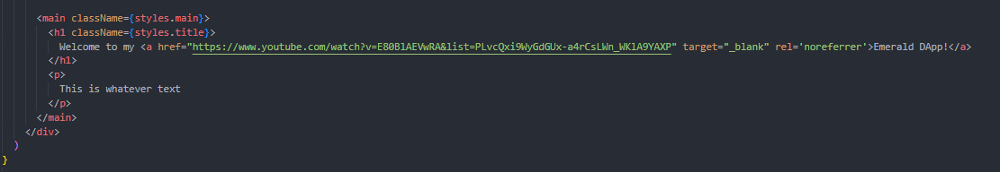
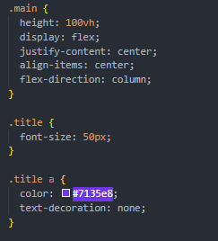

# Chapter 2 - Day 2

### 1. Change the color of "Emerald DApp" to whatever color you want
### 2. Change the font size of the title
### 3. Change the "Emerald DApp" link to a different link (this means messing with the `<a>` tag)
### 4a. Inside of your `<main>` tag, add a `
` tag and put whatever text you want in it.
### 4b. Go to the .main class and add this line: flex-direction: column. Watch what it does!

