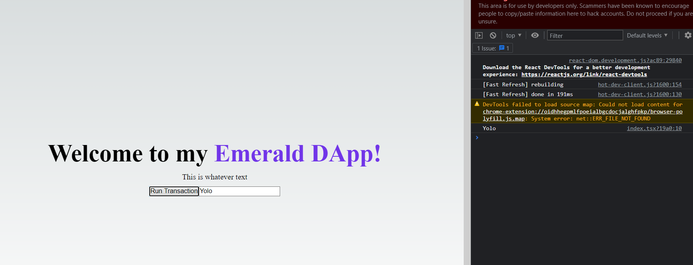
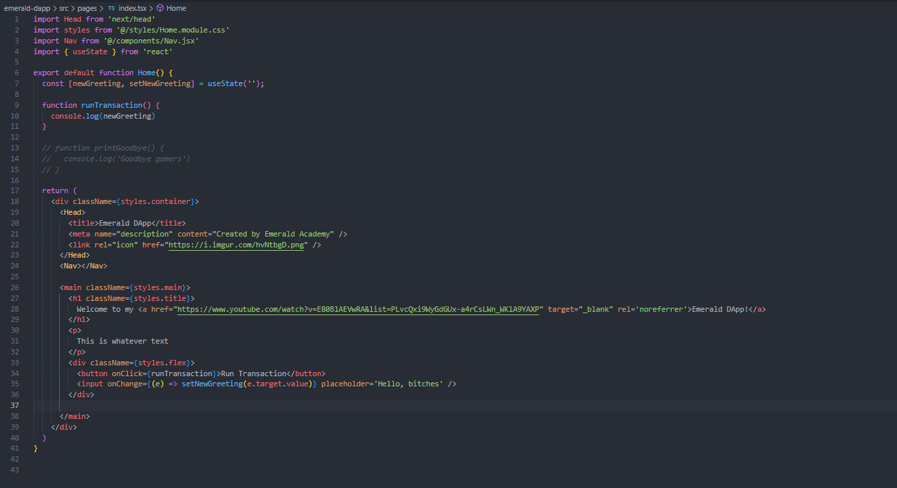

# Chapter 2 - Day 4

### Change the printHello function to be called runTransaction.
### Change the "Hello" text inside the button to "Run Transaction".
### Inside the runTransaction function, add some code to console log your newGreeting variable to the developer console.

Go back to your webpage, type something into the input box, and press "Run Transaction". Open your developer console and you will see some thing being printed!
To upload your quests, show us your ./pages/index.js file and take a screenshot of your newGreeting being printed to the developer console.

