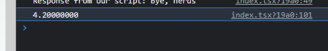

# Chapter 4 - Day 3

## Write a function that executes a script with all the Cadence types that we reviewed today. Call the script when the page refreshes. Return something random from the Cadence script, and console log it to prove to me your script actually worked.

  