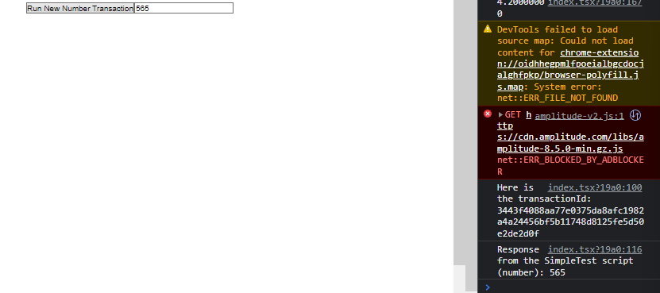

# Chapter 4 - Day 4

### 1. I deployed a contract called SimpleTest to an account with an address of 0x6c0d53c676256e8c. I want you to make a button that, when clicked, sends a transaction to change the number variable from that contract. If you're curious, you can see the contract here: https://flow-view-source.com/testnet/account/0x6c0d53c676256e8c/contract/SimpleTest

### 2. Immediately after you send the transaction, wait for the transaction to be "Sealed" just like we did today. Then, call a script to read the number from the contract. Console log the result.

#### Submit all the code you used to send the transaction, and the result of the script.

``` javascript
 const [number, setNumber] = useState('')
  const [newNumber, setNewNumber] = useState('')
  ```

``` javascript 
async function runNewNumberTransaction() {
    const transactionId = await fcl.mutate({
      cadence: `
      import SimpleTest from 0x6c0d53c676256e8c

      transaction(myNewNumber: Int) {

        prepare(signer: AuthAccount) {}

        execute {
          SimpleTest.updateNumber(newNumber: myNewNumber)
        }
      }
      `,
      args: (arg: any, t: any) => [
        arg(newNumber, t.Int)
      ],
      proposer: fcl.authz,
      payer: fcl.authz,
      authorizations: [fcl.authz],
      limit: 999
    })

    console.log("Here is the transactionId: " + transactionId);
    await fcl.tx(transactionId).onceSealed();
    readNewNumber();
  }
  ```
``` javascript 
async function readNewNumber() {
    const response = await fcl.query({
      cadence: `
      import SimpleTest from 0x6c0d53c676256e8c

      pub fun main(): Int {
          return SimpleTest.number
      }
      `,
      args: (arg: any, t: any) => []
    })
    console.log("Response from the SimpleTest script (number): " + response);
    setNumber(response);
  }
  useEffect(() => {
    readNewNumber()
  }, [])
  ```

  