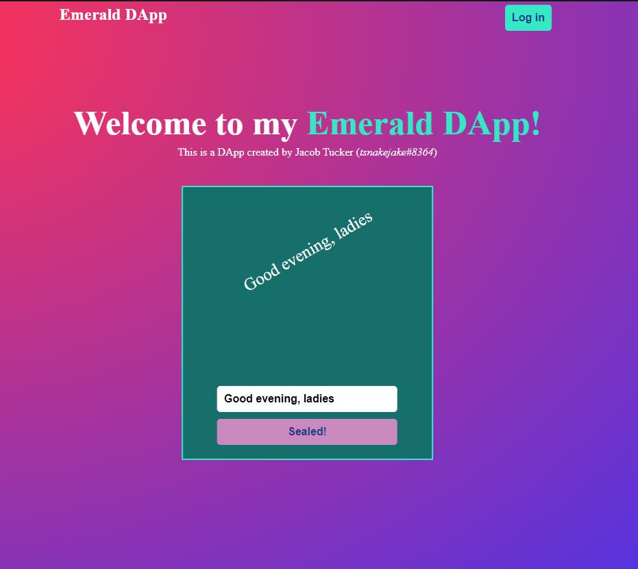

# Chapter 5 - Day 1

### 1. List all the possible transaction status codes and what each of them mean.
StatusCode 0 - Unknown
StatusCode 1 - Pending
StatusCode 2 - Finalized
StatusCode 3 - Executed
StatusCode 4 - Sealed
StatusCode 5 - Expired

### 2a. What does setTimeout do? 
Runs the code after a set amount of milliseconds. 

### 2b. How would we change our code if we wanted the txStatus variable to reset back to its original state after 5 seconds?
Change the amount of milliseconds from 2000 to 5000.
``` javascript
setTimeout(() => setTxStatus('Run Transaction'), 5000);
```

### 3. What does the fcl.tx(transactionId).subscribe(res => {...}) function do?
The function get the value of the StatusCode and stores it in the res object, which gets changed identically to the response status change.

### 4. Make at least 3 changes to the styling of the application. It can be anything (part of this quest is being creative!). List the 3 changes and point them out in a screenshot.



#### Changes
1. (The mouse tooltip is unavailable when taking a screenshot of the screen) The button, when on hover, changes it's back ground colour. Compare Log-in button at the top (unhovered) and Run-transaction button in lower part of the screen.
2. Background colour changed to a background-image with a radius gradient
3. Text is rotated by 30 degrees.